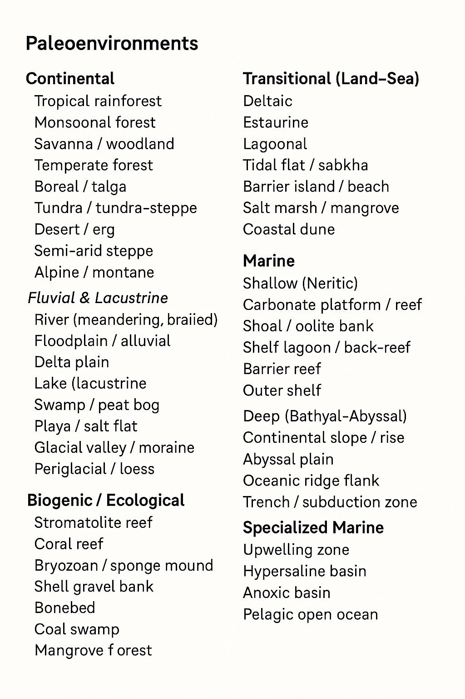

# Paleo Time Machine ⏳🌍
**Your backyard. 70 million years ago.**

A **sci-fi imagination engine** — slide time, watch your world reborn.
Powered by **Grok API**, **Firebase**, and **Mapbox**.

# Major Paleoenvironments
**A visual guide to ancient Earth settings preserved in the rock record**

---


## Continental
*Land-based ecosystems shaped by climate & elevation*

| Environment | Key Features |
|-------------|--------------|
| Tropical Rainforest | High rainfall, dense canopy |
| Monsoonal Forest | Seasonal wet/dry cycles |
| Savanna / Woodland | Grassland with scattered trees |
| Temperate Forest | Broadleaf & coniferous |
| Boreal / Taiga | Cold, evergreen forests |
| Tundra / Steppe | Treeless, permafrost |
| Desert / Erg | Arid dunes, wind erosion |
| Semi-arid Steppe | Sparse grass, drought |
| Alpine / Montane | High-elevation, thin soils |

---

## Fluvial & Lacustrine
*Freshwater systems driven by rivers, lakes & floods*

| Environment | Key Features |
|-------------|--------------|
| River (Meandering/Braided) | Channels, point bars |
| Floodplain / Alluvial | Overbank silts, soils |
| Delta Plain | Distributaries, wetlands |
| Lake (Lacustrine) | Laminated muds, varves |
| Swamp / Peat Bog | Organic-rich, coal-forming |
| Playa / Salt Flat | Ephemeral lakes, evaporites |
| Glacial Valley / Moraine | Till, outwash plains |
| Periglacial / Loess | Wind-blown silt, frost features |

---

## Transitional (Land–Sea)
*Dynamic coastal zones where land meets ocean*

| Environment | Key Features |
|-------------|--------------|
| Deltaic | Prograding lobes, brackish |
| Estuarine | Tidal mixing, funnel shape |
| Lagoonal | Protected, shallow water |
| Tidal Flat / Sabkha | Mudflats, evaporites |
| Barrier Island / Beach | Sand bars, wave energy |
| Salt Marsh / Mangrove | Vegetated, fine sediment |
| Coastal Dune | Wind-blown sand ridges |

---

## Marine
*Ocean basins from shallow shelves to deep trenches*

### Shallow (Neritic)
| Environment | Key Features |
|-------------|--------------|
| Carbonate Platform / Reef | Warm, clear water, limestone |
| Shoal / Oolite Bank | High-energy grainstones |
| Shelf Lagoon / Back-reef | Low energy, protected |
| Barrier Reef | Offshore framework |
| Outer Shelf | Below wave base, muds |

### Deep (Bathyal–Abyssal)
| Environment | Key Features |
|-------------|--------------|
| Continental Slope / Rise | Turbidites, slumps |
| Abyssal Plain | Flat, pelagic oozes |
| Oceanic Ridge Flank | Volcanic, hydrothermal |
| Trench / Subduction Zone | Sediment starvation |

---

## Biogenic / Ecological
*Landscapes built by life*

| Environment | Key Features |
|-------------|--------------|
| Stromatolite Reef | Microbial carbonates |
| Coral Reef | Framework builders |
| Bryozoan / Sponge Mound | Bioherms, deep water |
| Shell Gravel Bank | Mollusk accumulations |
| Bonebed | Vertebrate concentrations |
| Coal Swamp | Peat → coal, anaerobic |
| Mangrove Forest | Saline-tolerant trees |

---

## Extreme / Specialized
*Rare, high-energy, or chemically unique settings*

| Environment | Key Features |
|-------------|--------------|
| Upwelling Zone | Nutrient-rich, high productivity |
| Hypersaline Basin | Restricted, thick evaporites |
| Anoxic Basin | Oxygen-free, black shales |
| Pelagic Open Ocean | Far from land, slow sedimentation |
| Volcanic Plain | Lava flows, ash beds |
| Hydrothermal Vent | Chemosynthetic ecosystems |
| Impact Crater Lake | Shock metamorphism, ejecta |

---

> **Purpose**: Use this chart to interpret sedimentary rocks, fossils, and climate signals — reconstructing ancient worlds from modern outcrops.
---

Together, these categories span the full spectrum of **Earth’s depositional systems**, forming the foundation for interpreting **paleoecology, sedimentology, and climate evolution through deep time**.

---

## Vision
**Step into your street as a Jurassic jungle — in VR, on your phone.**

| Future Feature | Tech |
|----------------|------|
| Full VR Immersion | WebXR + Gaussian Splats |
| Photorealistic Flora | AI-generated 3D (Luma AI) |
| Dynamic Weather & Fauna | Procedural |
| Time Capsule Sharing | AR/VR links |
| Educational Mode | Scotese, GPlates, citations |
| Offline PWA | 100k locations × 12 eras cached |
| Monetization | Premium eras, VR export, schools |

---

## Roadmap: MVP → Vision

| Phase | Goal | Time | Deliverables |
|-------|------|------|-------------|
| **0** | MVP: Map + Slider + Grok Text | 1 day | Live app, 6 eras, text scene |
| **1** | Visuals | 1 week | AI image, retro UI, share |
| **2** | 3D Preview | 2 weeks | Three.js terrain + flora |
| **3** | Science Layer | 3 weeks | GPlates + Scotese accuracy |
| **4** | VR Ready | 6 weeks | WebXR + Gaussian splat export |
| **5** | Scale & Share | Ongoing | PWA, classroom, API |

---


```markdown
paleo-time-machine/
├── functions/
│   └── index.js          # Single Cloud Function: generatePaleoScene (Grok proxy)
│   └── package.json      # firebase-functions, axios
│   └── .env.example      # GROK_API_KEY
├── public/
│   ├── index.html
│   └── favicon.ico
├── src/
│   ├── components/
│   │   ├── MapPicker.jsx     # Mapbox + search
│   │   ├── TimeMachineSlider.jsx  # 0–100 Ma, 6 era snaps
│   │   └── PaleoScene.jsx    # Text + AI image (placeholder)
│   ├── services/
│   │   └── grok.js           # httpsCallable → generatePaleoScene
│   ├── data/
│   │   └── eras.json         # 6 eras: 0, 5, 15, 50, 70, 100
│   ├── App.jsx
│   ├── main.jsx
│   └── firebase.js           # Firebase init
├── .env.example
├── .gitignore
├── firebase.json
├── package.json          # react, firebase, mapbox-gl, axios, react-slider
├── vite.config.js
└── README.md             # “Slide time. See your world reborn.”
```
---
<!--
```markdown
paleo-time-machine/
├── .github/
│   └── workflows/
│       └── ci.yml                    # Test + deploy on push
├── functions/
│   ├── src/
│   │   ├── index.ts                  # generateScene, getPastCoords, cacheBiome
│   │   ├── paleomap.ts               # GPlates API wrapper
│   │   ├── imageGen.ts               # SDXL / DALL·E
│   │   └── threeScene.ts             # Terrain + flora generator
│   ├── .env.example
│   ├── package.json                  # firebase-functions, axios, @google-cloud/storage
│   ├── tsconfig.json
│   └── firebase.json
├── public/
│   ├── index.html
│   ├── manifest.json                 # PWA: “Paleo Time Machine”
│   ├── favicon.ico
│   ├── robots.txt
│   └── assets/
│       ├── icons/                    # PWA icons
│       └── era-thumbs/               # 12 era preview images
├── src/
│   ├── components/
│   │   ├── MapPicker.jsx             # Mapbox + geocoding + GPS
│   │   ├── TimeMachineSlider.jsx     # 0–100 Ma, 12 snaps + retro dial
│   │   ├── PaleoSceneCard.jsx        # Text + AI image + 3D preview
│   │   ├── ExportMenu.jsx            # GLB / VR / Splats / Share
│   │   ├── EraBadge.jsx              # Label + Scotese citation
│   │   ├── TimeMachineGlobe.jsx      # Animated globe loader
│   │   ├── VRButton.jsx              # Enter WebXR
│   │   ├── ShareModal.jsx            # Time capsule link
│   │   └── OfflineBanner.jsx         # PWA status
│   ├── context/
│   │   ├── TimeMachineContext.js     # location, era, scene, cache
│   │   └── AuthContext.js            # Optional user + saves
│   ├── core/
│   │   ├── gplates.js                # Reconstruct past lat/lon
│   │   ├── biomeEngine.js            # Scotese + elevation → biome
│   │   └── promptBuilder.js          # Dynamic Grok prompt
│   ├── data/
│   │   ├── eras.json                 # 12 eras: name, ma, biome, flora, fauna
│   │   └── floraDB.json              # 100+ plant models + metadata
│   ├── hooks/
│   │   ├── usePastCoords.js          # GPlates fetch + cache
│   │   ├── useAIImage.js             # SDXL via Replicate
│   │   ├── useThreeScene.js          # Generate terrain + instances
│   │   └── useGaussianSplat.js       # Future splat export
│   ├── pages/
│   │   ├── Home.jsx                  # Map + slider + GO
│   │   ├── SceneView.jsx             # Full result + 3D/VR
│   │   ├── SavedCapsules.jsx         # User history
│   │   └── About.jsx                 # Sci-fi disclaimer + sources
│   ├── services/
│   │   ├── grok.js                   # Firebase Function → Grok-3
│   │   ├── imageGen.js               # SDXL / DALL·E
│   │   ├── storage.js                # Firebase Storage for assets
│   │   └── analytics.js              # Track popular eras/locations
│   ├── styles/
│   │   ├── globals.css               # Tailwind + retro CRT
│   │   ├── TimeMachineSlider.css
│   │   ├── Map.css
│   │   └── SceneCard.css
│   ├── utils/
│   │   ├── formatMa.js               # “70 Ma” → “Cretaceous”
│   │   ├── shareScene.js             # PNG + URL + AR link
│   │   ├── soundEngine.js            # Dial click + hum
│   │   └── pwa.js                    # Service worker logic
│   ├── App.jsx                       # React Router: / → /scene/:id
│   ├── main.jsx
│   ├── firebase.js                   # Init + auth + emulators
│   └── index.css
├── cache/
│   ├── redis/                        # Pre-warmed: 100k locations × 12 eras
│   └── firebase/                     # Firestore cache layer
├── 3d/
│   ├── assets/                       # Low-poly + high-res flora
│   │   ├── cycad.glb
│   │   ├── fern.glb
│   │   └── conifer.glb
│   └── splats/                       # Gaussian splat exports
├── tests/
│   ├── unit/
│   └── e2e/
├── .env.example
├── .env.production
├── .gitignore
├── firebase.json
├── firestore.rules
├── storage.rules
├── package.json                      # react, mapbox-gl, three, @react-three/fiber, firebase, axios
├── vite.config.js                    # Proxy /functions
├── tailwind.config.js
├── postcss.config.js
├── tsconfig.json
├── vite-env.d.ts
└── README.md                         # “Slide back. See what grew here.”
``` -->